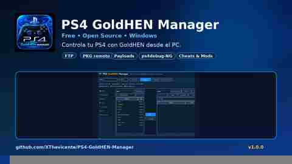

<p align="center">
  
</p>

<p align="center">
  <a href="https://github.com/XThevicente/PS4-GoldHEN-Manager/releases/latest"></a>
  <a href="https://github.com/XThevicente/PS4-GoldHEN-Manager/releases"></a>
  <a href="LICENSE"></a>
  
</p>

# PS4 GoldHEN Manager

**PS4 GoldHEN Manager** is a free and open-source Windows companion app for PS4 consoles running GoldHEN.

The goal is simple: bring the most useful PC-side GoldHEN workflows into one clean interface instead of juggling several separate tools.

## Download

### Windows

**[Download the latest release](https://github.com/XThevicente/PS4-GoldHEN-Manager/releases/latest)**

Current public release: **v1.0.0**

Direct v1.0.0 EXE:
[PS4_GoldHEN_Manager_v1.0.0.exe](https://github.com/XThevicente/PS4-GoldHEN-Manager/releases/download/v1.0.0/PS4_GoldHEN_Manager_v1.0.0.exe)

No Python installation is required when using the compiled Windows release.

## Features

- **Automatic PS4 discovery** on the local network.
- **GoldHEN FTP file manager** over port `:2121`.
- **PC ↔ PS4 transfers** with a `/data/pkg` workflow.
- **Remote Package Installer** support on `:12800`.
- **Integrated HTTP server** for remote PKG installs.
- **GoldHEN Payload Server** support on `:9090`.
- **Klog viewer** on `:3232`.
- **ps4debug-NG integration** on `:744`.
- **PS4 / service information** in one place.
- **Installed-game library** from local `app.db` copies/backups.
- **Cheats & Mods** support for compatible GoldHEN cheat definitions, intended for local/offline use.
- Native **Windows icon / taskbar branding** and one-click PyInstaller build.

## Quick start

1. Start your PS4 and enable **GoldHEN**.
2. Make sure the PC and PS4 are on the same local network.
3. Download and run the latest Windows EXE.
4. Press **Buscar PS4** or enter the PS4 IP manually.
5. Enable the GoldHEN service you want to use:
   - FTP: `:2121`
   - Payload Server: `:9090`
   - Klog: `:3232`
   - ps4debug-NG: `:744`
   - Remote Package Installer: `:12800`
6. Connect and use the corresponding tool from the sidebar.

> Remote Package Installer must be running on the PS4 for RPI installs.

## Public v1.0 scope

The first public release intentionally focuses on the stable core.

**Online catalog, Themes and Trophies are not part of v1.0.0** while those areas are being redesigned and tested. They may return later once they are ready for general use.

## Run from source

```bat
pip install -r requirements.txt
python ps4_manager.py
```

## Build the Windows EXE

Run:

```bat
build_windows.bat
```

The compiled executable is created under `dist/` and uses the bundled PS4 GoldHEN Manager icon.

## GitHub Actions

The project includes a Windows build workflow under `.github/workflows/`, so public changes can be validated and packaged without requiring contributors to reproduce the full Windows build manually.

## Feedback and contributions

Found a bug or have an idea?

- Open a **Bug report** from the Issues tab.
- Open a **Feature request** for improvements.
- Pull requests are welcome.
- Please include your **PS4 firmware**, **GoldHEN version**, and clear reproduction steps when reporting connection/service issues.

See [CONTRIBUTING.md](CONTRIBUTING.md).

## Safety / legal

Use only software, homebrew, payloads and PKG content that you are authorized to use.

This project does **not** distribute commercial games, license keys or DRM-bypass content.

Cheats & Mods are intended for **local/offline use**. Do not use them to interfere with competitive online play.

## Credits

PS4 GoldHEN Manager builds on public PS4 homebrew interfaces and projects including **GoldHEN**, **ps4debug-NG** and **Remote Package Installer**. Those projects remain the work of their respective authors.

## License

Released under the **MIT License**. See [LICENSE](LICENSE).
